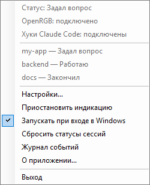
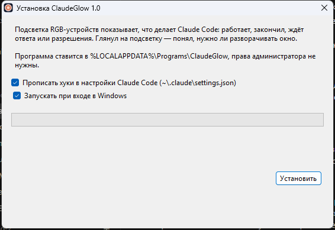
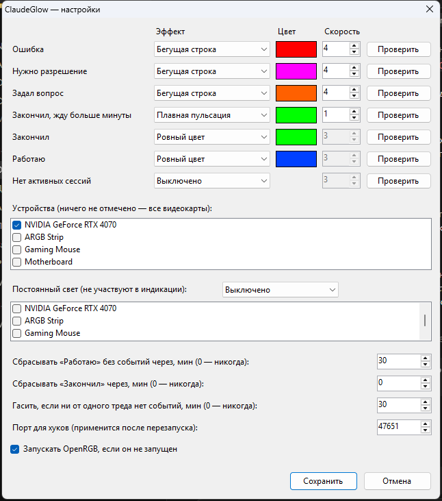

# ClaudeGlow

Трей-сервис: показывает подсветкой RGB-устройств (видеокарта, лента, мышь — всё, чем управляет
[OpenRGB](https://openrgb.org)), что делает Claude Code. Глянул на подсветку — понял, нужно ли
разворачивать окно: Claude работает, закончил, задал вопрос или ждёт разрешения.

**Актуальная версия** — на странице [Releases](../../releases/latest), что изменилось — в [истории версий](CHANGELOG.md).



Работает с Claude Code в терминале, в десктопном приложении (вкладка Code) и в расширениях
редакторов — везде, где Claude Code читает `~/.claude/settings.json`.

## Установка

1. Поставь [OpenRGB](https://openrgb.org) и включи в нём SDK-сервер (вкладка SDK Server → Start
   Server, порт `6742`). Удобнее всего — службой Windows или с ключом `--server` в автозапуске.
2. Скачай `ClaudeGlowSetup.exe` со страницы [Releases](../../releases) и запусти. Права
   администратора не нужны: программа ставится в `%LOCALAPPDATA%\Programs\ClaudeGlow`.
3. Оставь галочку «Прописать хуки» — установщик добавит хуки ClaudeGlow в
   `~/.claude/settings.json`, ничего другого в файле не меняя (копия прежнего файла —
   `settings.json.claudeglow.bak`). Уже открытые сессии Claude Code подхватят хуки после перезапуска.



Удаление — «Параметры → Приложения → ClaudeGlow → Удалить»: снимает хуки ClaudeGlow (чужие хуки
не трогает), автозапуск, удаляет программу и настройки.

Хуки можно прописать и позже: меню трея → «Хуки Claude Code не подключены — подключить».

## Настройки



Для каждого статуса — эффект, цвет и скорость, кнопка «Проверить» показывает эффект 5 секунд.
Ниже — какие устройства участвуют в индикации и какие держат постоянный свет.

## Как устроено

1. Claude Code на события сессии шлёт HTTP-хук (`type: "http"`) на `http://127.0.0.1:47651/hook`.
   Хуки прописаны в `~/.claude/settings.json`.
2. ClaudeGlow по соединению находит процесс-отправитель, поднимается по родителям до `claude.exe`
   (или `node.exe`) — это процесс треда. Каждый тред десктопа — отдельный `claude.exe`.
3. Статус хранится по каждому треду (`session_id`). Итоговый цвет — самый важный статус среди всех.
4. Подсветкой управляет OpenRGB через SDK-сервер (`127.0.0.1:6742`, протокол версии 3).

## Статусы (по убыванию важности)

| Статус | Откуда | По умолчанию |
|---|---|---|
| Ошибка | `StopFailure` (ошибка API, лимит, сеть) | бегущая строка, красный, скорость 4 |
| Нужно разрешение | `Notification` / `permission_prompt` | бегущая строка, пурпурный `#FF00FF`, 4 |
| Задал вопрос | `PreToolUse` для `AskUserQuestion`, `Notification` / `elicitation_dialog` | бегущая строка, оранжевый, 4 |
| Закончил, жду больше минуты | «Закончил» дольше 60 с (свой таймер) или `Notification` / `idle_prompt` | плавная пульсация, зелёный, 1 |
| Закончил | `Stop` | ровный зелёный |
| Работаю | `UserPromptSubmit`, `PostToolUse`, `PostToolUseFailure`, `Stop` с незавершёнными фоновыми задачами | ровный синий |
| Нет активных сессий | ни одного живого треда | выключено |

**Закончил + Работаю.** Если самый важный статус — «Закончил» (или «жду больше минуты»), а другой
тред при этом работает, карта делится: первая половина светодиодов — цвет «Закончил», вторая — цвет
«Работаю», ровным светом. Значок в трее тоже делится пополам. Статусы, требующие тебя (ошибка,
разрешение, вопрос), по-прежнему занимают всю карту. Деление работает, если у обоих статусов эффект с
цветом и у устройства есть режим Static с цветом на каждый диод.

**Когда гаснет «Нужно разрешение».** События «разрешил» у Claude Code нет, а `PostToolUse` приходит
только после завершения команды — для долгой сборки это минуты. Поэтому раз в 5 с ClaudeGlow смотрит
на процесс треда: появилась новая дочерняя оболочка (`bash`, `sh`, `powershell`, `pwsh`, `cmd`) после
запроса — значит, разрешил и команда пошла, статус «Работаю». Отказ ловится хуком `PermissionDenied`.
Инструменты без дочернего процесса (правка файлов) и так завершаются за доли секунды.

**Вопросы и разрешения при работающих агентах.** Тред может задать вопрос или ждать разрешения и
параллельно работать: агенты продолжают читать файлы и запускать команды. Их события приходят с тем же
`session_id`, но с полем `agent_id`. Поэтому «нужен ты» запоминается за исполнителем — основным тредом
или конкретным агентом — и снимается только его же событием: ответом на вопрос, следующим действием,
отказом (`PermissionDenied`), запуском разрешённой команды, а для основного треда ещё новым промптом и
концом хода. Работа других агентов вопрос не сбивает: пока есть неотвеченный вопрос или запрос, тред
показывает его, а не «Работаю».

**Фоновые задачи.** Тред может закончить ход, оставив работать фоновые агенты (линзы), команды,
воркфлоу или мониторы. Claude Code перечисляет их в поле `background_tasks` события `Stop`: список не
пустой — тред остаётся в «Работаю», таймаут «Работаю без событий» для него не действует. Задача
закончилась — Claude будит тред, тот присылает новый `Stop`, уже с пустым списком, — «Закончил».

«Ошибка» снимается только новым промптом в этом треде (`Stop` её не перебивает).
Упавший инструмент (`PostToolUseFailure`) — не ошибка, а рядовая работа.

Проверено в десктопном приложении (Claude Code 2.1.284): `permission_prompt` приходит ровно при показе
диалога разрешения; `idle_prompt` не приходит — поэтому «жду больше минуты» считает сам ClaudeGlow.
Хук `PermissionRequest` не годится: срабатывает на каждую проверку разрешения, включая решённые
авторежимом без диалога, — карта мигала бы впустую.

## Когда тред считается закрытым

- пришёл `SessionEnd`;
- процесс `claude.exe` треда завершился — проверка раз в 5 с по PID и времени старта процесса
  (таймер работает, только пока есть треды с известным процессом);
- страховки (проверка раз в 15 с): «Работаю» без событий дольше `workingTimeoutMinutes` (30) → сброс; «Закончил» дольше
  `doneTimeoutMinutes` (0 — никогда) → сброс; любой тред без событий 12 ч → удаляется.

Периодического «я жив» у Claude Code нет: тред, ждущий пользователя, молчит. Поэтому живость — по
процессу, а не по тишине.

## Исходная подсветка

При первом подключении к OpenRGB ClaudeGlow запоминает текущий режим и цвета каждого устройства и
возвращает их при паузе, выходе и завершении сеанса Windows. При статусе «Нет активных сессий»
подсветка по умолчанию выключается (эффект меняется в настройках).
Запомненное живёт в памяти процесса: если ClaudeGlow убит посреди мигания, при следующем запуске
«исходной» станет мигание — поправь цвет в OpenRGB и перезапусти ClaudeGlow.

## Постоянный свет

Устройства из списка «Постоянный свет» в индикации не участвуют: при каждом подключении к OpenRGB
ClaudeGlow ставит им один эффект (`fixedDevices`, `fixedEffect` в `settings.txt`). Пример — погасить
подсветку материнской платы: у некоторых контроллеров нет режима Off, тогда ставится Static с чёрным
цветом. Плата после перезагрузки возвращает свой сохранённый режим, поэтому держит её именно
ClaudeGlow; при выходе из ClaudeGlow эти устройства не восстанавливаются. Тусклый нейтральный вместо
выключения — «Ровный цвет» и тёмно-серый, например `#202020`.

## Пересканирование OpenRGB

При пересканировании (подключили устройство, кнопка Rescan) OpenRGB меняет номера устройств и шлёт
уведомление «список изменился». ClaudeGlow проверяет его раз в 15 с, перечитывает список и заново
применяет индикацию и постоянный свет. Новые устройства попадают в списки настроек.

Устройство, которого нет в OpenRGB, ClaudeGlow не видит: список поддерживаемого — на сайте OpenRGB.

## Эффекты

**Бегущая строка** — программный эффект, выбран пользователем для статусов, где нужен он: лента
погашена, по ней бежит яркий сегмент с затухающим хвостом в 5 диодов. Круг по скорости 1–5: 2,4 / 1,8 /
1,2 / 0,9 / 0,6 с.

**Плавная пульсация** — программный эффект: карта в режиме Direct, ClaudeGlow 25 раз в секунду меняет
яркость по синусоиде от 100 % до 20 % — свет не гаснет. Период по скорости 1–5: 3,2 / 2,4 / 1,8 / 1,3 /
0,9 с. Таймер кадров (40 мс) работает только пока горит программный эффект (пульсация или бегущая строка).

Остальное — встроенные режимы контроллера (анимацию крутит сама карта, CPU не тратится). Встроенные
Breathing и Flashing у некоторых контроллеров (например, ENE на видеокартах ASUS) гасят диоды полностью,
поэтому по умолчанию не используются. Набор режимов и диапазон скорости у каждого устройства свои —
OpenRGB отдаёт их сам. Уровень скорости 1–5 в настройках раскладывается линейно на диапазон устройства. Режима нет у устройства — берётся Static.

## Трей

- Значок — кружок цвета текущего статуса (серый — эффект без цвета или пауза; пустое кольцо — нет
  связи с OpenRGB).
- Двойной клик — настройки. Правая кнопка — статус, связь с OpenRGB, список тредов со статусами,
  «Настройки…», «Приостановить индикацию», «Запускать при входе в Windows», «Сбросить статусы
  сессий», «Журнал событий», «О приложении…», «Выход».
- Настройки: эффект / цвет / скорость на каждый статус и кнопка «Проверить» (5 с), устройства
  (ничего не отмечено — все видеокарты), таймауты, порт хуков (после перезапуска), автозапуск OpenRGB.

## Автозапуск

- ClaudeGlow: ключ `HKCU\...\Run\ClaudeGlow`, включается при первом запуске, переключается в трее.
  Права администратора не нужны.
- OpenRGB: ClaudeGlow сам запускает `OpenRGB.exe --startminimized --server`, если не может
  подключиться и процесса OpenRGB нет (не чаще раза в минуту). Путь — `openRgbPath` в `settings.txt`.
- Фирменные программы подсветки (ASUS Aura `LightingService`, MSI Mystic Light, iCUE и т.п.) лучше
  отключить — иначе перебивают цвета.
- Если OpenRGB стоит службой Windows, запуск из ClaudeGlow не нужен и не срабатывает.

## Грабли

**После переустановки драйвера видеокарты смена режима молча не работает.** Симптом: бегущая строка
и пульсация горят (покадровая запись цветов проходит), а переход на ровный цвет не происходит —
подсветка замирает на последнем кадре. OpenRGB принимает команду смены режима, но активный режим
устройства не меняется, ошибок нет ни в одном журнале. Лечение — перезапустить службу из PowerShell
от администратора: `Restart-Service OpenRGB`. ClaudeGlow переподключится сам.

## Файлы

Программа — в `%LOCALAPPDATA%\Programs\ClaudeGlow`, данные — в `%LOCALAPPDATA%\ClaudeGlow`:

- `settings.txt` — настройки (`key=value`, UTF-8).
- `sessions.txt` — статусы тредов; переживают перезапуск ClaudeGlow, при загрузке треды с
  завершившимся процессом отбрасываются.
- `log.txt` — журнал событий хуков (при 512 КБ переезжает в `log.old.txt`).
## Сборка

Штатный `csc` .NET Framework 4.8, C# 5, без SDK и NuGet.

```
build.cmd nostart     программа → ClaudeGlow.exe
build-installer.cmd   программа, деинсталлятор и установщик → dist\ClaudeGlowSetup.exe
```

Без `nostart` скрипт запускает программу, и обёртка, вызвавшая `.cmd`, висит до её закрытия.

## Проверка без Claude

```
printf '%s' '{"session_id":"t1","cwd":"D:/x","hook_event_name":"Notification","notification_type":"permission_prompt"}' | curl -s --data-binary @- http://127.0.0.1:47651/hook
```

Статус снимается `SessionEnd` для того же `session_id` или смертью процесса-отправителя
(для curl из терминала отправитель — ближайший `claude.exe`/`node.exe` по родителям).

## Лицензия

MIT — см. [LICENSE](LICENSE).
